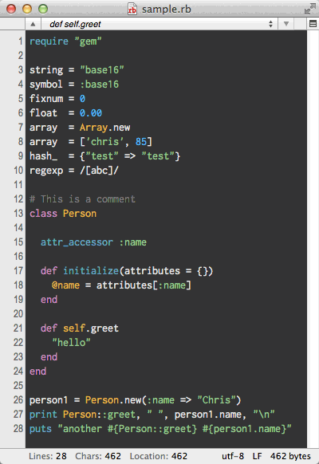

# CotEditor Themes

Themes for [CotEditor 2](https://github.com/coteditor/CotEditor).

These files were originally created for Xcode and converted by [CotEditorThemeConverter](https://github.com/naotaka/CotEditorThemeConverter).

By using it, you can convert your own themes, too.

You can browse all screenshots on [my site](http://www.naotaka.com/coteditorthemes/).

## Download

[CotEditor-themes.zip](https://github.com/naotaka/CotEditor-themes/releases/download/v20141016/CotEditor-themes.zip)

## Installation

1. Double-click the theme(s) or copy the theme(s) to the CotEditor's Themes folder (~/Library/Application Support/CotEditor/Themes).
2. Restart CotEditor.
3. Enjoy.

## Credits

Original Xcode theme creators:

* [Base16](https://github.com/joedynamite/base16-xcode4) by Chris Kempson (Modified by Joe Bilt)
* [Solarized](https://github.com/brianmichel/solarized) by Ethan Schoonover (Modified by Brian Michel)
* [2morrow Night](https://github.com/fidgetfu/xcode-themes) by Amy Nugent
* [2morrow Night (Eighties)](https://github.com/fidgetfu/xcode-themes) by Amy Nugent
* [Coal Graal](https://github.com/fidgetfu/xcode-themes) by Amy Nugent
* [Glitterbomb](https://github.com/fidgetfu/xcode-themes) by Amy Nugent
* [Kellys](https://github.com/fidgetfu/xcode-themes) by Amy Nugent
* [Monokai](https://github.com/fidgetfu/xcode-themes) by Amy Nugent
* [Night](https://github.com/fidgetfu/xcode-themes) by Amy Nugent
* [Resesif](https://github.com/fidgetfu/xcode-themes) by Amy Nugent
* [Sidewalk Chalk](https://github.com/fidgetfu/xcode-themes) by Amy Nugent
* [Sunset](https://github.com/fidgetfu/xcode-themes) by Amy Nugent
* [Humane](https://github.com/jbrennan/xcode4themes) by Damien Guard (Modified by Jason Brennan)
* [ObsidianCode](https://github.com/jbrennan/xcode4themes) by Ben Scheirman (Modified by Jason Brennan)
* [flatland-xcode](https://github.com/mduvall/flatland-xcode) by Matt DuVall
* [ElChachoColorTheme](https://github.com/orlandoaleman/ElChachoColorTheme) by Orlando Aleman
* [Ciapre Xcode](https://github.com/vinhnx/Ciapre-Xcode-theme) by Vinh Nguyen
* [Taology](https://github.com/cissusnar/xcodeColorTheme) by isaac zhang
* [Zenburn](https://github.com/an0/Zenburn-for-Xcode) by Ling Wang
